# DigitalBankingWeb-frontend

### Introduction
Le projet a pour objectif de développer une application web utilisant Angular comme 
framework front-end et une API Spring Boot comme backend. L'application se concentre 
sur la gestion des clients, des comptes bancaires, des relations clients-comptes,
et inclut un système d'authentification.

Il est important de souligner que ce compte rendu se concentre principalement sur la partie frontend du projet, mettant en lumière la structuration du code, les différentes fonctionnalités implémentées, et la robustesse du système de sécurité intégré pour répondre aux besoins spécifiques de gestion.

### Composants

1. **Composants**
   - **Customers & New-Customer Component** : Composant dédié à la gestion des clients.
   - **Accounts Component**: Composant pour la gestion des comptes bancaires.
   - **Customers-Accounts Component**: Composant assurant la gestion des relations entre clients et comptes.
   - **Login Component**: Composant d'authentification permettant aux utilisateurs de se connecter.
   - **environment.ts** :utilisé dans le projet Angular pour définir les variables d'environnement.
   - **not-authorized**:

2. **Services**
  - **Customers-Services**: Service associé à la gestion des clients.
  - **Accounts-Services**: Service responsable de la gestion des comptes bancaires.
  - **Auth-Service**: Service d'authentification assurant la sécurité de l'application.

3. **Intercepteurs**
  - Des intercepteurs ont été créés pour gérer les requêtes HTTP sortantes et entrantes, assurant un contrôle et une gestion des erreurs appropriés.

4. **Guards**
  - **Authentication Guard**: Un garde-frontière qui protège les routes nécessitant une authentification.
  - **Authorization Guard**: Un garde-frontière qui gère l'autorisation d'accès aux différentes parties de l'application.

5. **Définition des Routes**
  - Les routes ont été définies de manière à permettre une navigation fluide et intuitive au sein de l'application. Des routes sont protégées par les guards d'authentification et d'autorisation pour garantir la sécurité.
us les composants, services, intercepteurs et guards ont été testés de manière exhaustive pour assurer un fonctionnement correct et identifier tout comportement indésirable.

### Gestion des Pages d'Accès
**Admin Page**

- Login
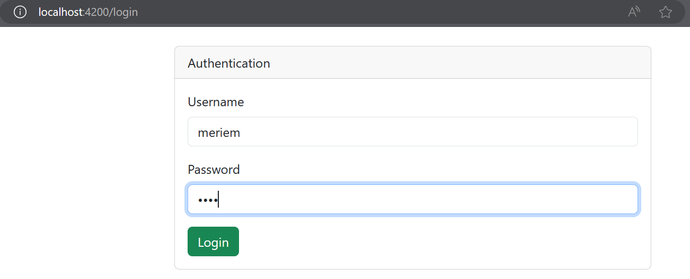
- L'ajout d'un nouveau client
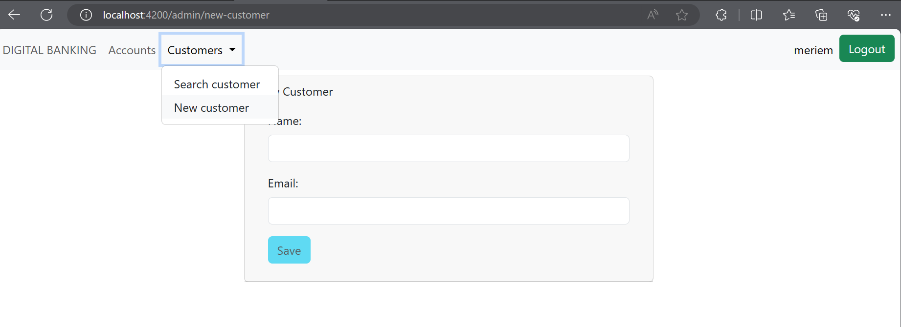
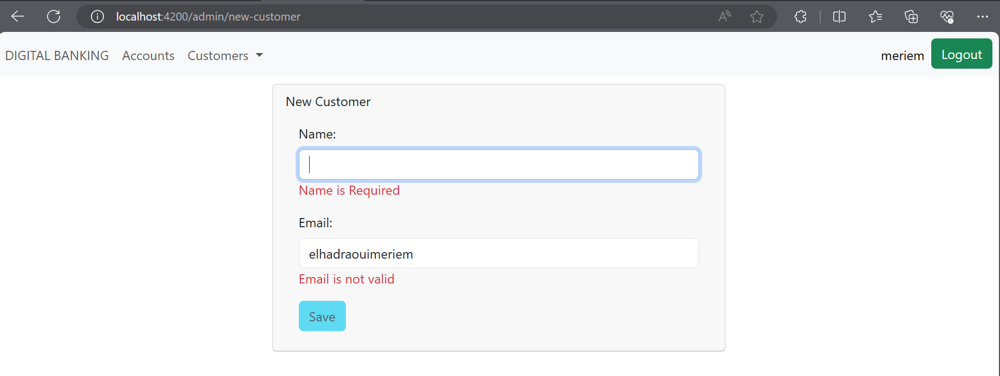
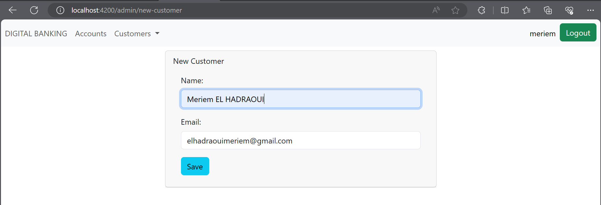
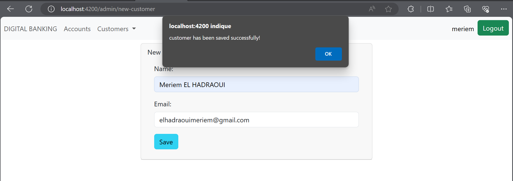
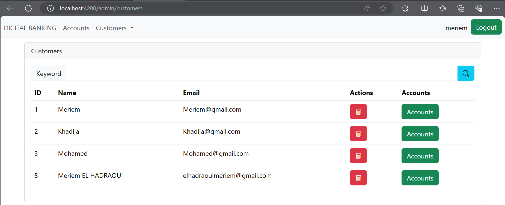
- Chercher
  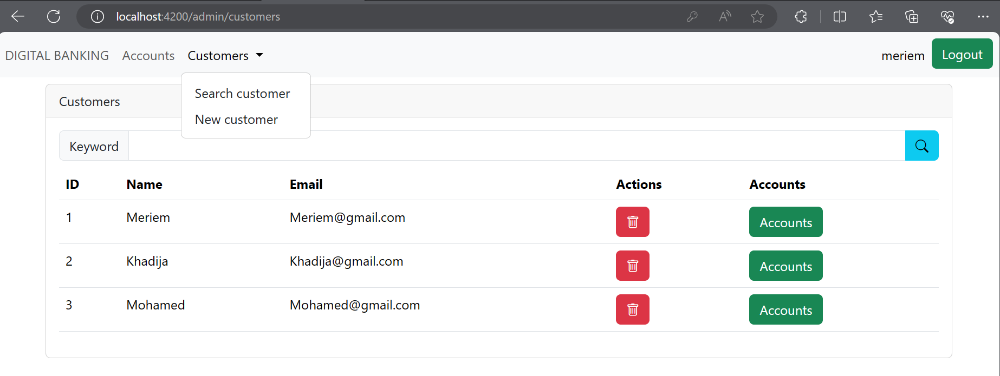
  
- Supprimer un client
  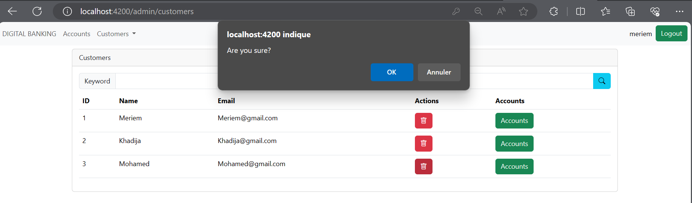

- Les Opérations
  + Crédit
  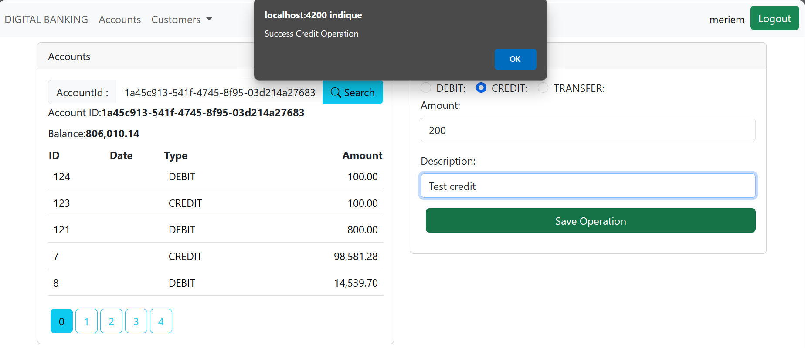
  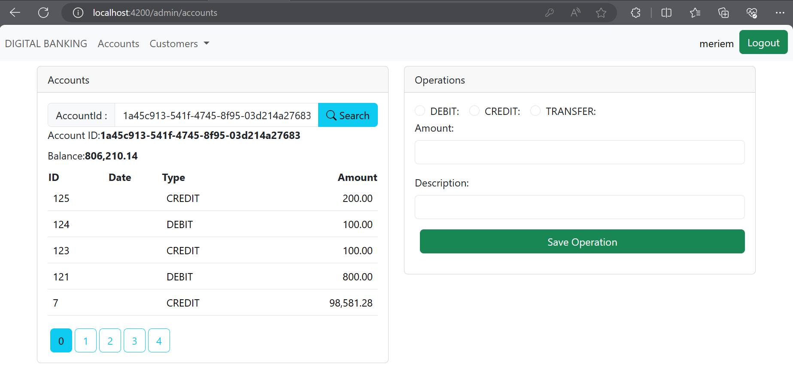
 + Débit
  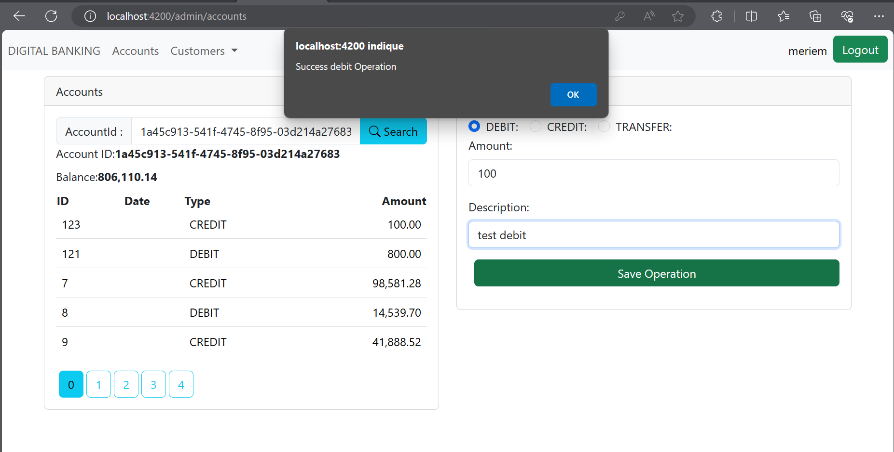
  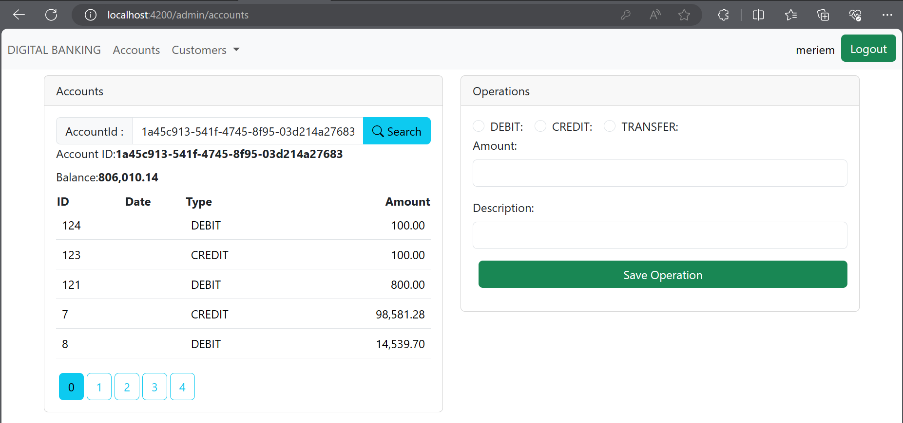
 + Transfer
    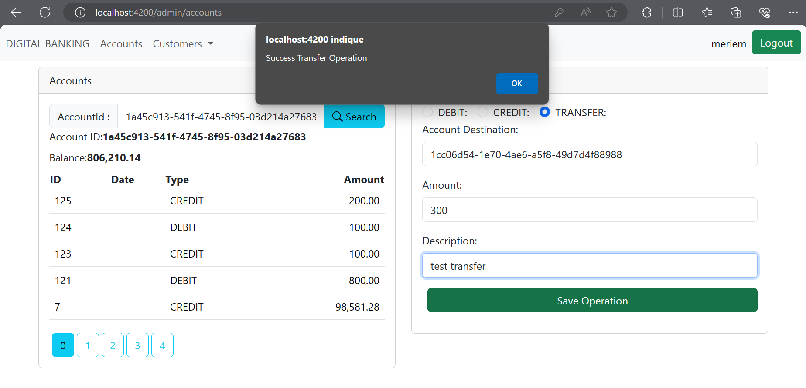
    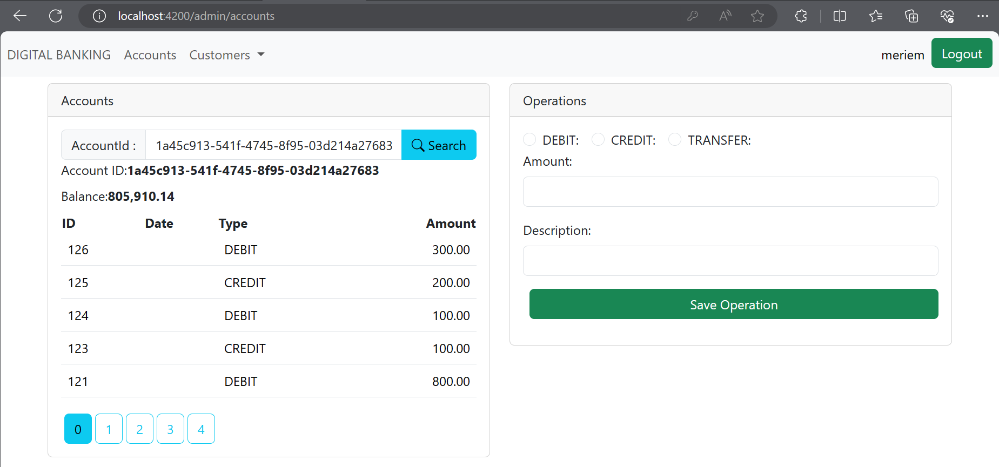
- Pagination
  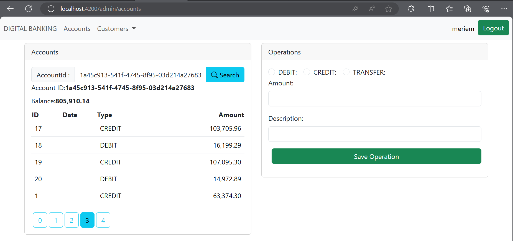

**User Page**

- Login
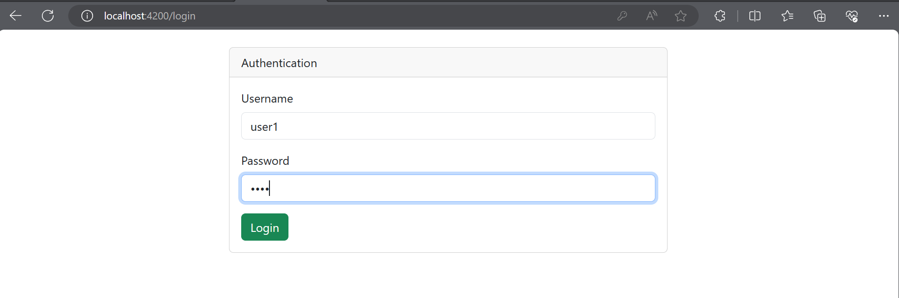
- Chercher
    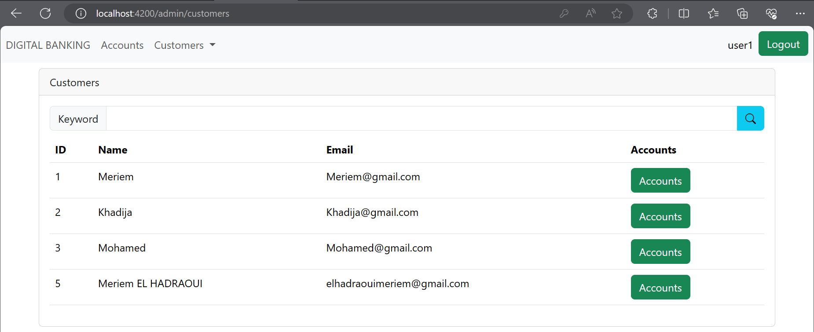
    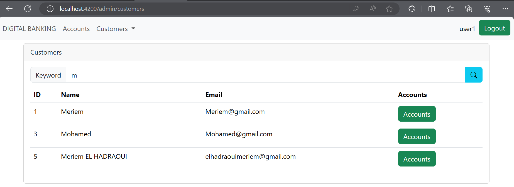
- Chercher un compte
  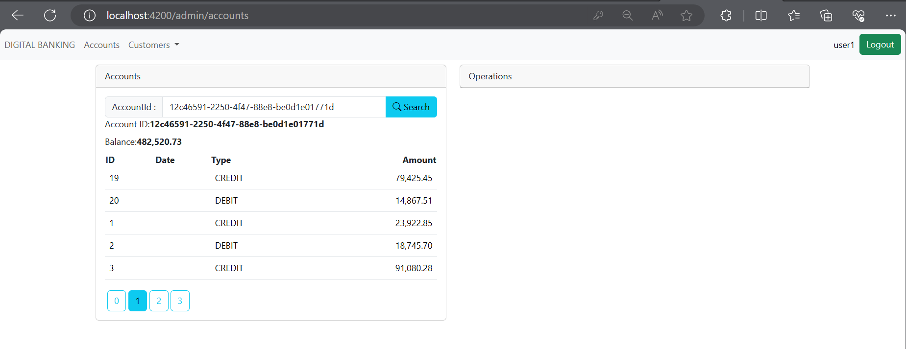

### Conclusion
Ce projet a permis de mettre en place une application frontend robuste et sécurisée, répondant efficacement aux exigences de gestion bancaire. La structure claire du code, la mise en œuvre des fonctionnalités, ainsi que le système de sécurité intégré témoignent de l'efficacité de la conception.
